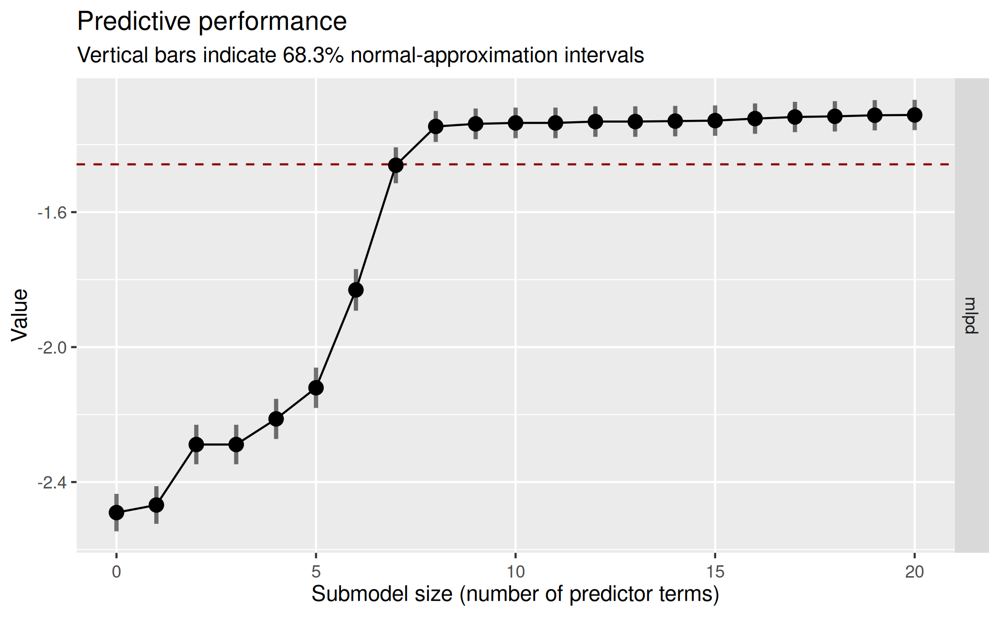
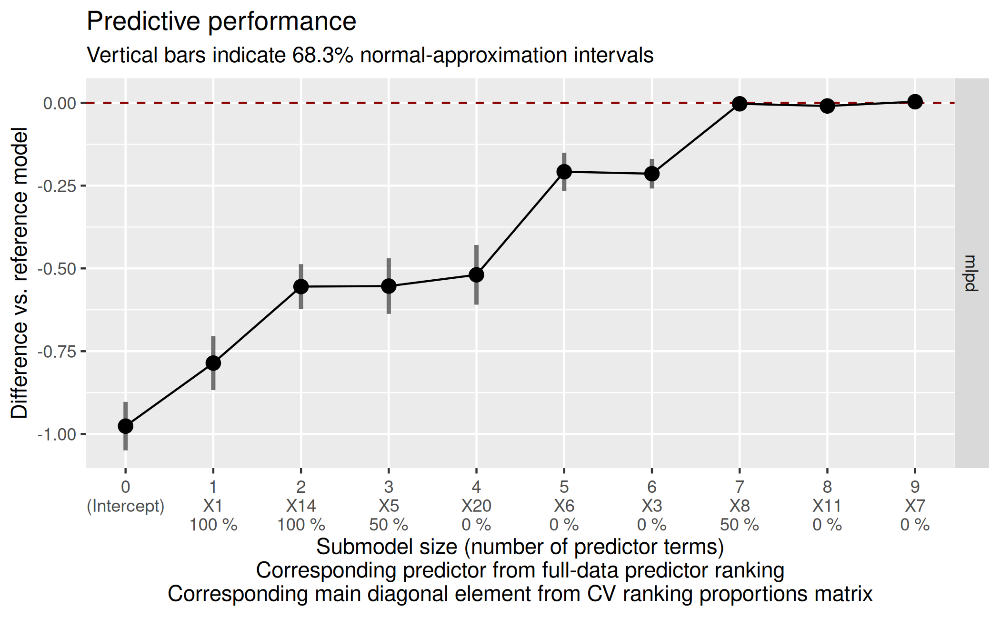
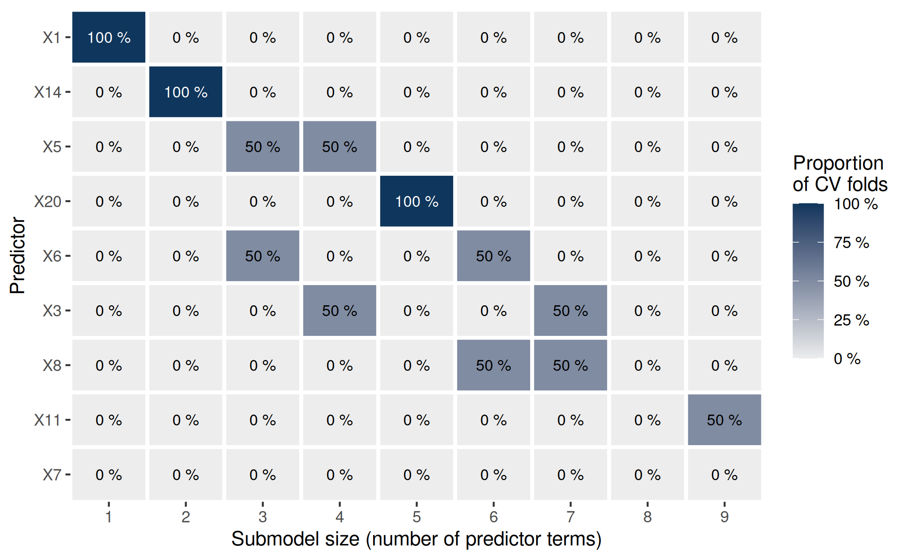
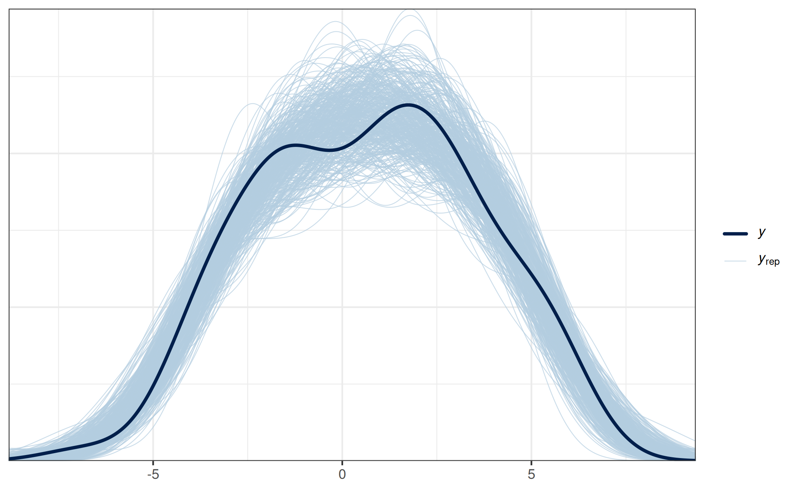

# projpred: Projection predictive feature selection

## Introduction

This vignette illustrates the main functionalities of the **projpred**
package, which implements the projection predictive variable selection
for various regression models (see section [“Supported types of
models”](#modtypes) below for more details on supported model types).
What is special about the projection predictive variable selection is
that it not only performs a variable selection, but also allows for
(approximately) valid post-selection inference.

The projection predictive variable selection is based on the ideas of
Goutis and Robert ([1998](#ref-goutis_model_1998)) and Dupuis and Robert
([2003](#ref-dupuis_variable_2003)). The methods implemented in
**projpred** are described in detail in Piironen, Paasiniemi, and
Vehtari ([2020](#ref-piironen_projective_2020)), Catalina, Bürkner, and
Vehtari ([2022](#ref-catalina_projection_2022)), Weber, Glass, and
Vehtari ([2025](#ref-weber_projection_2025)), and Catalina, Bürkner, and
Vehtari ([2021](#ref-catalina_latent_2021)). A comparison to many other
methods may also be found in Piironen and Vehtari
([2017a](#ref-piironen_comparison_2017)). An introduction to the theory
behind **projpred**, a workflow for practitioners, and further insights
into the theory (and practice) of projection predictive inference are
presented by McLatchie et al. ([2025](#ref-mclatchie_advances_2025)).
For details on how to cite **projpred**, see the [projpred citation
info](https://CRAN.R-project.org/package=projpred/citation.html) on
CRAN[¹](#fn1).

## Data

For this vignette, we use **projpred**’s `df_gaussian` data. It contains
100 observations of 20 continuous predictor variables `X1`, …, `X20`
(originally stored in a sub-matrix; we turn them into separate columns
below) and one continuous response variable `y`.

``` r
data("df_gaussian", package = "projpred")
dat_gauss <- data.frame(y = df_gaussian$y, df_gaussian$x)
```

## Reference model

First, we have to construct a reference model for the projection
predictive variable selection. This model is considered as the best
(“reference”) solution to the prediction task. The aim of the projection
predictive variable selection is to find a subset of a set of candidate
predictors which is as small as possible but achieves a predictive
performance as close as possible to that of the reference model.

Usually (and this is also the case in this vignette), the reference
model will be an [**rstanarm**](https://mc-stan.org/rstanarm/) or
[**brms**](https://paulbuerkner.com/brms/) fit. To our knowledge,
**rstanarm** and **brms** are currently the only packages for which a
[`get_refmodel()`](https://mc-stan.org/projpred/dev/reference/refmodel-init-get.md)
method (which establishes the compatibility with **projpred**) exists.
Creating a reference model object via one of these methods
[`get_refmodel.stanreg()`](https://mc-stan.org/projpred/dev/reference/refmodel-init-get.md)
or
[`brms::get_refmodel.brmsfit()`](https://paulbuerkner.com/brms/reference/get_refmodel.brmsfit.html)
(either implicitly by a call to a top-level function such as
[`project()`](https://mc-stan.org/projpred/dev/reference/project.md),
[`varsel()`](https://mc-stan.org/projpred/dev/reference/varsel.md), and
[`cv_varsel()`](https://mc-stan.org/projpred/dev/reference/cv_varsel.md),
as done below, or explicitly by a call to
[`get_refmodel()`](https://mc-stan.org/projpred/dev/reference/refmodel-init-get.md))
leads to a “typical” reference model object. In that case, all candidate
models are actual *sub*models of the reference model. In general,
however, this assumption is not necessary for a projection predictive
variable selection (see, e.g., [Piironen, Paasiniemi, and Vehtari
2020](#ref-piironen_projective_2020)). This is why “custom” (i.e.,
non-“typical”) reference model objects allow to avoid this assumption
(although the candidate models of a “custom” reference model object will
still be actual *sub*models of the full `formula` used by the search
procedure—which does not have to be the same as the reference model’s
`formula`, if the reference model possesses a `formula` at all). Such
“custom” reference model objects can be constructed via
[`init_refmodel()`](https://mc-stan.org/projpred/dev/reference/refmodel-init-get.md)
(or
[`get_refmodel.default()`](https://mc-stan.org/projpred/dev/reference/refmodel-init-get.md)),
as shown in section “Examples” of the
[`?init_refmodel`](https://mc-stan.org/projpred/dev/reference/refmodel-init-get.md)
help.

Here, we use the **rstanarm** package to fit the reference model. If you
want to use the **brms** package, simply replace the **rstanarm** fit
(of class `stanreg`) in all the code below by your **brms** fit (of
class `brmsfit`).

``` r
library(rstanarm)
```

For our **rstanarm** reference model, we use the Gaussian distribution
as the `family` for our response. With respect to the predictors, we
only include the linear main effects of all 20 predictor variables.
Compared to the more complex types of reference models supported by
**projpred** (see section [“Supported types of models”](#modtypes)
below), this is a quite simple reference model which is sufficient,
however, to demonstrate the interplay of **projpred**’s functions.

We use **rstanarm**’s default priors in our reference model, except for
the regression coefficients for which we use a regularized horseshoe
prior ([Piironen and Vehtari 2017c](#ref-piironen_sparsity_2017)) with
the hyperprior for its global shrinkage parameter following Piironen and
Vehtari ([2017b](#ref-piironen_hyperprior_2017)) and Piironen and
Vehtari ([2017c](#ref-piironen_sparsity_2017)). In R code, these are the
preparation steps for the regularized horseshoe prior:

``` r
# Number of regression coefficients:
( D <- sum(grepl("^X", names(dat_gauss))) )
```

    [1] 20

``` r
# Prior guess for the number of relevant (i.e., non-zero) regression
# coefficients:
p0 <- 5
# Number of observations:
N <- nrow(dat_gauss)
# Hyperprior scale for tau, the global shrinkage parameter (note that for the
# Gaussian family, 'rstanarm' will automatically scale this by the residual
# standard deviation):
tau0 <- p0 / (D - p0) * 1 / sqrt(N)
```

We now fit the reference model to the data. To make this vignette build
faster, we use only 2 MCMC chains and 1000 iterations per chain (with
half of them being discarded as warmup draws). In practice, 4 chains and
2000 iterations per chain are reasonable defaults. Furthermore, we make
use of [**rstan**](https://mc-stan.org/rstan/)’s parallelization, which
means to run each chain on a separate CPU core[²](#fn2). If you run the
following code yourself, you can either rely on an automatic mechanism
to detect the number of CPU cores (like the
[`parallel::detectCores()`](https://rdrr.io/r/parallel/detectCores.html)
function shown below) or adapt `ncores` manually to your system.

``` r
# Set this manually if desired:
ncores <- parallel::detectCores(logical = FALSE)
### Only for technical reasons in this vignette (you can omit this when running
### the code yourself):
ncores <- min(ncores, 2L)
###
options(mc.cores = ncores)
set.seed(50780)
refm_fit <- stan_glm(
  y ~ X1 + X2 + X3 + X4 + X5 + X6 + X7 + X8 + X9 + X10 + X11 + X12 + X13 + X14 +
    X15 + X16 + X17 + X18 + X19 + X20,
  family = gaussian(),
  data = dat_gauss,
  prior = hs(global_scale = tau0),
  ### Only for the sake of speed (not recommended in general):
  chains = 2, iter = 1000,
  ###
  refresh = 0
)
```

Usually, we would now have to check the convergence diagnostics (see,
e.g.,
[`?posterior::diagnostics`](https://mc-stan.org/posterior/reference/diagnostics.html)
and
[`?posterior::default_convergence_measures`](https://mc-stan.org/posterior/reference/draws_summary.html)).
However, due to the technical reasons for which we reduced `chains` and
`iter`, we skip this step here.

## Variable selection

Now, **projpred** comes into play.

``` r
library(projpred)
```

From the reference model fit (called `refm_fit` here), we create a
reference model object (i.e., an object of class `refmodel`) since this
avoids redundant calculations in the remainder of this
vignette[³](#fn3):

``` r
refm_obj <- get_refmodel(refm_fit)
```

In **projpred**, the projection predictive variable selection relies on
a so-called *search* part and a so-called *evaluation* part. The search
part determines the predictor ranking (also known as solution path),
i.e., the best submodel for each submodel size (the size is given by the
number of predictor terms). The evaluation part determines the
predictive performance of the increasingly complex submodels along the
predictor ranking.

There are two functions for running the combination of search and
evaluation:
[`varsel()`](https://mc-stan.org/projpred/dev/reference/varsel.md) and
[`cv_varsel()`](https://mc-stan.org/projpred/dev/reference/cv_varsel.md).
In contrast to
[`varsel()`](https://mc-stan.org/projpred/dev/reference/varsel.md),
[`cv_varsel()`](https://mc-stan.org/projpred/dev/reference/cv_varsel.md)
performs a cross-validation (CV). With `cv_method = "LOO"` (the
default),
[`cv_varsel()`](https://mc-stan.org/projpred/dev/reference/cv_varsel.md)
runs a Pareto-smoothed importance sampling leave-one-out CV (PSIS-LOO
CV, see [Vehtari, Gelman, and Gabry 2017](#ref-vehtari_practical_2017);
[Vehtari et al. 2022](#ref-vehtari_pareto_2022)). With
`cv_method = "kfold"`,
[`cv_varsel()`](https://mc-stan.org/projpred/dev/reference/cv_varsel.md)
runs a \\K\\-fold CV. The extent of the CV mainly depends on
[`cv_varsel()`](https://mc-stan.org/projpred/dev/reference/cv_varsel.md)’s
argument `validate_search`: If `validate_search = TRUE` (the default),
the search part is run with the training data of each CV fold separately
and the evaluation part is run with the corresponding test data of each
CV fold. If `validate_search = FALSE`, the search is excluded from the
CV so that only a single full-data search is run. Because of its more
thorough protection against overfitting[⁴](#fn4),
[`cv_varsel()`](https://mc-stan.org/projpred/dev/reference/cv_varsel.md)
with `validate_search = TRUE` is recommended over
[`varsel()`](https://mc-stan.org/projpred/dev/reference/varsel.md) and
[`cv_varsel()`](https://mc-stan.org/projpred/dev/reference/cv_varsel.md)
with `validate_search = FALSE`. Nonetheless, a preliminary and
comparatively fast run of
[`varsel()`](https://mc-stan.org/projpred/dev/reference/varsel.md) or
[`cv_varsel()`](https://mc-stan.org/projpred/dev/reference/cv_varsel.md)
with `validate_search = FALSE` can give a rough idea of the performance
of the submodels and can be used for finding a suitable value for
argument `nterms_max` in subsequent runs (argument `nterms_max` imposes
a limit on the submodel size up to which the search is continued and is
thus able to reduce the runtime considerably).

### Preliminary `cv_varsel()` run

To illustrate a preliminary
[`cv_varsel()`](https://mc-stan.org/projpred/dev/reference/cv_varsel.md)
run with `validate_search = FALSE`, we set `nterms_max` to the number of
predictor terms in the full model, i.e., `nterms_max = 20`. To speed up
the building of the vignette (this is not recommended in general), we
choose the `"L1"` search `method` and set `refit_prj` to `FALSE`.

``` r
# Preliminary cv_varsel() run:
cvvs_fast <- cv_varsel(
  refm_obj,
  validate_search = FALSE,
  ### Only for the sake of speed (not recommended in general):
  method = "L1",
  refit_prj = FALSE,
  ###
  nterms_max = 20,
  ### In interactive use, we recommend not to deactivate the verbose mode:
  verbose = 0
  ### 
)
```

To find a suitable value for `nterms_max` in subsequent
[`cv_varsel()`](https://mc-stan.org/projpred/dev/reference/cv_varsel.md)
runs, we take a look at a plot of at least one predictive performance
statistic in dependence of the submodel size. Here, we choose the mean
log predictive density (MLPD; see the documentation for argument `stats`
of
[`summary.vsel()`](https://mc-stan.org/projpred/dev/reference/summary.vsel.md)
for details) as the only performance statistic. Since we will be using
the following plot only to determine `nterms_max` for subsequent
[`cv_varsel()`](https://mc-stan.org/projpred/dev/reference/cv_varsel.md)
runs, we can omit the predictor ranking from the plot by setting
`ranking_nterms_max` to `NA` (which requires
`size_position = "primary_x_bottom"`, which we set here via its global
option, just like argument `text_angle`):

``` r
options(projpred.plot_vsel_size_position = "primary_x_bottom")
options(projpred.plot_vsel_text_angle = 0)
plot(cvvs_fast, stats = "mlpd", ranking_nterms_max = NA)
```

 This plot suggests
that the submodel MLPD levels off from submodel size 8 on. However, we
used L1 search with `refit_prj = FALSE`, which means that the
projections employed for the predictive performance evaluation are
L1-penalized, which is usually undesired ([Piironen, Paasiniemi, and
Vehtari 2020, sec. 4](#ref-piironen_projective_2020)). Thus, to
investigate the impact of `refit_prj = FALSE`, we re-run
[`cv_varsel()`](https://mc-stan.org/projpred/dev/reference/cv_varsel.md),
but this time with the default of `refit_prj = TRUE` and re-using the
search results (as well as the CV-related arguments such as
`validate_search`; see section “Usage” in
[`?cv_varsel.vsel`](https://mc-stan.org/projpred/dev/reference/cv_varsel.md))
from the former
[`cv_varsel()`](https://mc-stan.org/projpred/dev/reference/cv_varsel.md)
call (this is done by applying
[`cv_varsel()`](https://mc-stan.org/projpred/dev/reference/cv_varsel.md)
to `cvvs_fast` instead of `refm_obj` so that the
[`cv_varsel()`](https://mc-stan.org/projpred/dev/reference/cv_varsel.md)
generic dispatches to the
[`cv_varsel.vsel()`](https://mc-stan.org/projpred/dev/reference/cv_varsel.md)
method that was introduced in **projpred** 2.8.0[⁵](#fn5)). To save
time, we also set `nclusters_pred` to a comparatively low value of `20`:

``` r
# Preliminary cv_varsel() run with `refit_prj = TRUE`:
cvvs_fast_refit <- cv_varsel(
  cvvs_fast,
  ### Only for the sake of speed (not recommended in general):
  nclusters_pred = 20,
  ###
  ### In interactive use, we recommend not to deactivate the verbose mode:
  verbose = 0
  ### 
)
```

    Using standard importance sampling (SIS) due to a small number of clusters.

Here, we ignore the warning that SIS is used (instead of PSIS) because
this is due to `nclusters_pred = 20` which we used only to speed up the
building of the vignette.

With the `refit_prj = TRUE` results, the predictive performance plot
from above now looks as follows:

``` r
plot(cvvs_fast_refit, stats = "mlpd", ranking_nterms_max = NA)
```

 This refined
plot confirms that the submodel MLPD does not change much after submodel
size 8, so in our final
[`cv_varsel()`](https://mc-stan.org/projpred/dev/reference/cv_varsel.md)
run, we set `nterms_max` to a value slightly higher than 8 (here: 9) to
ensure that we see the MLPD leveling off. The search results from the
initial `cvvs_fast` object could now be re-used again (via
[`cv_varsel.vsel()`](https://mc-stan.org/projpred/dev/reference/cv_varsel.md))
for investigating the sensitivity of the results to changes in
`nclusters_pred` (or `ndraws_pred`). Here, we skip this for the sake of
brevity and instead head over to the final
[`cv_varsel()`](https://mc-stan.org/projpred/dev/reference/cv_varsel.md)
run.

### Final `cv_varsel()` run

For this final
[`cv_varsel()`](https://mc-stan.org/projpred/dev/reference/cv_varsel.md)
run (with `validate_search = TRUE`, as recommended), we use a \\K\\-fold
CV with a small number of folds (`K = 2`) to make this vignette build
faster. In practice, we recommend using either the default of
`cv_method = "LOO"` (possibly subsampled, see argument `nloo` of
[`cv_varsel()`](https://mc-stan.org/projpred/dev/reference/cv_varsel.md))
or a larger value for `K` if this is possible in terms of computation
time. Here, we also perform the \\K\\ reference model refits outside of
[`cv_varsel()`](https://mc-stan.org/projpred/dev/reference/cv_varsel.md).
Although not strictly necessary here, this is helpful in practice
because often,
[`cv_varsel()`](https://mc-stan.org/projpred/dev/reference/cv_varsel.md)
needs to be re-run multiple times in order to try out different argument
settings. We also show how **projpred**’s CV (i.e., the CV comprising
search and performance evaluation, after refitting the reference model
\\K\\ times) can be parallelized (though we disable it here for vignette
building). In practice, parallelization is of little use with only
`K = 2` folds and fast fold-wise operations, as the parallelization
overhead eats up any runtime improvements. Note that for this final
[`cv_varsel()`](https://mc-stan.org/projpred/dev/reference/cv_varsel.md)
run, we cannot make use of
[`cv_varsel.vsel()`](https://mc-stan.org/projpred/dev/reference/cv_varsel.md)
(by applying
[`cv_varsel()`](https://mc-stan.org/projpred/dev/reference/cv_varsel.md)
to `cvvs_fast` or `cvvs_fast_refit` instead of `refm_obj`) because of
the change in `nterms_max` (here: 9, for `cvvs_fast` and
`cvvs_fast_refit`: 20).

``` r
# Refit the reference model K times:
cv_fits <- run_cvfun(
  refm_obj,
  ### Only for the sake of speed (not recommended in general):
  K = 2
  ###
)
# For running projpred's CV in parallel (see cv_varsel()'s argument `parallel`):
# Note: Parallel processing is disabled during package building to avoid issues
use_parallel <- FALSE  # Set to TRUE for actual parallel processing
if (use_parallel) {
  doParallel::registerDoParallel(ncores)
}
# Final cv_varsel() run:
cvvs <- cv_varsel(
  refm_obj,
  cv_method = "kfold",
  cvfits = cv_fits,
  ### Only for the sake of speed (not recommended in general):
  method = "L1",
  nclusters_pred = 20,
  ###
  nterms_max = 9,
  parallel = use_parallel,
  ### In interactive use, we recommend not to deactivate the verbose mode:
  verbose = 0
  ### 
)
# Tear down the CV parallelization setup:
if (use_parallel) {
  doParallel::stopImplicitCluster()
  foreach::registerDoSEQ()
}
```

#### Predictive performance plot from final `cv_varsel()` run

We can now select a final submodel size by looking at a predictive
performance plot similar to the one created for the preliminary
[`cv_varsel()`](https://mc-stan.org/projpred/dev/reference/cv_varsel.md)
run above. By default, the performance statistics are plotted on their
actual scale and the uncertainty bars match this scale, but argument
`deltas` of
[`plot.vsel()`](https://mc-stan.org/projpred/dev/reference/plot.vsel.md)
offers two more options:

- With `deltas = TRUE`, the performance statistics are plotted on
  *difference scale*, i.e., as differences[⁶](#fn6) from the baseline
  model[⁷](#fn7) and the uncertainty bars match this scale,
- With `deltas = "mixed"`, the performance statistics (i.e., their point
  estimates) are plotted on the actual scale, but the uncertainty bars
  visualize the difference-scale uncertainty.

Since the difference-scale uncertainty is usually more helpful than the
actual-scale uncertainty (at least with regard to the decision for a
final submodel size), we plot with `deltas = TRUE` here
(`deltas = "mixed"` would be another good choice). We also set
`show_cv_proportions = TRUE` (via its global option) for illustrative
purposes, which becomes clearer in section [“Predictor ranking(s) from
final `cv_varsel()` run and identification of the selected
submodel”](#rksel):

``` r
options(projpred.plot_vsel_show_cv_proportions = TRUE)
plot(cvvs, stats = "mlpd", deltas = TRUE)
```



#### Decision for final submodel size

Based on that final predictive performance plot, we decide for a
submodel size. Usually, the aim is to find the smallest submodel size
where the predictive performance of the submodels levels off and is
close enough to the reference model’s predictive performance (the dashed
red horizontal line).

Sometimes, the plot may be ambiguous because after reaching the
reference model’s performance, the submodels’ performance may keep
increasing (and hence become even better than the reference model’s
performance[⁸](#fn8)). In that case, one has to find a suitable
trade-off between predictive performance (accuracy) and model size
(sparsity) in the context of subject-matter knowledge.

Here, we decide for a submodel size of 7 because it seems to provide the
best trade-off between sparsity and accuracy (size 7 is the smallest
size where the submodel MLPD is close enough to the reference model MLPD
and from size 7 on, the submodel MLPD levels off).

``` r
size_decided <- 7
```

In section [“Predictor ranking(s) from final `cv_varsel()` run and
identification of the selected submodel”](#rksel), the predictor ranking
and the (CV) ranking proportions that are shown in the plot (below the
submodel sizes on the x-axis) are explained in detail—and also how they
could have been incorporated into our decision for a submodel size.

The
[`suggest_size()`](https://mc-stan.org/projpred/dev/reference/suggest_size.md)
function offered by **projpred** may help in the decision for a submodel
size, but this is a rather heuristic method and needs to be interpreted
with caution (see
[`?suggest_size`](https://mc-stan.org/projpred/dev/reference/suggest_size.md)):

``` r
suggest_size(cvvs, stat = "mlpd")
```

    [1] 7

In this case, that heuristic gives the same final submodel size (`7`) as
our manual decision.

#### Predictive performance table from final `cv_varsel()` run

A tabular representation of the plot created by
[`plot.vsel()`](https://mc-stan.org/projpred/dev/reference/plot.vsel.md)
can be achieved via
[`summary.vsel()`](https://mc-stan.org/projpred/dev/reference/summary.vsel.md)
or
[`performances()`](https://mc-stan.org/projpred/dev/reference/performances.md).
In contrast to
[`performances()`](https://mc-stan.org/projpred/dev/reference/performances.md),
the output of
[`summary.vsel()`](https://mc-stan.org/projpred/dev/reference/summary.vsel.md)
contains more information than just the predictive performance results,
which is also why there is a sophisticated
[`print()`](https://rdrr.io/r/base/print.html) method for objects of
class `vselsummary` (the output of
[`summary.vsel()`](https://mc-stan.org/projpred/dev/reference/summary.vsel.md)).
This method
[`print.vselsummary()`](https://mc-stan.org/projpred/dev/reference/print.vselsummary.md)
is also called by the shortcut method
[`print.vsel()`](https://mc-stan.org/projpred/dev/reference/print.vsel.md)
which can be applied to an object resulting from
[`varsel()`](https://mc-stan.org/projpred/dev/reference/varsel.md) or
[`cv_varsel()`](https://mc-stan.org/projpred/dev/reference/cv_varsel.md).

Specifically, to create the table matching the predictive performance
plot above as closely as possible (and to also adjust the minimum number
of printed significant digits), we may call
[`summary.vsel()`](https://mc-stan.org/projpred/dev/reference/summary.vsel.md)
and
[`print.vselsummary()`](https://mc-stan.org/projpred/dev/reference/print.vselsummary.md)
as follows:

``` r
smmry <- summary(cvvs,
                 stats = "mlpd",
                 type = c("mean", "lower", "upper"),
                 deltas = TRUE)
print(smmry, digits = 1)
```

    Family: gaussian 
    Link function: identity 

    Formula: y ~ X1 + X2 + X3 + X4 + X5 + X6 + X7 + X8 + X9 + X10 + X11 + 
        X12 + X13 + X14 + X15 + X16 + X17 + X18 + X19 + X20
    Observations: 100
    Projection method: traditional
    CV method: K-fold CV with K = 2 and search included (i.e., fold-wise searches)
    Search method: L1
    Maximum submodel size for the search: 9
    Number of projected draws in the search: 1 (from clustered projection)
    Number of projected draws in the performance evaluation: 20 (from clustered projection)
    Argument `refit_prj`: TRUE

    Submodel performance evaluation summary with `deltas = TRUE` and `cumulate = FALSE`:
     size ranking_fulldata cv_proportions_diag   mlpd mlpd.lower mlpd.upper
        0      (Intercept)                  NA -0.976      -1.05     -0.903
        1               X1                 1.0 -0.786      -0.87     -0.704
        2              X14                 1.0 -0.555      -0.62     -0.487
        3               X5                 0.5 -0.553      -0.64     -0.469
        4              X20                 0.0 -0.519      -0.61     -0.429
        5               X6                 0.0 -0.208      -0.27     -0.151
        6               X3                 0.0 -0.214      -0.26     -0.169
        7               X8                 0.5 -0.003      -0.02      0.016
        8              X11                 0.0 -0.010      -0.03      0.008
        9               X7                 0.0  0.003      -0.01      0.020

    Reference model performance evaluation summary with `deltas = TRUE`:
          mlpd mlpd.lower mlpd.upper 
             0          0          0 

The generic function
[`performances()`](https://mc-stan.org/projpred/dev/reference/performances.md)
(with main method
[`performances.vselsummary()`](https://mc-stan.org/projpred/dev/reference/performances.md)
and the shortcut method
[`performances.vsel()`](https://mc-stan.org/projpred/dev/reference/performances.md))
essentially extracts the predictive performance results from the output
of
[`summary.vsel()`](https://mc-stan.org/projpred/dev/reference/summary.vsel.md):

``` r
perf <- performances(smmry)
str(perf)
```

    List of 2
     $ submodels      :'data.frame':    10 obs. of  4 variables:
      ..$ size      : num [1:10] 0 1 2 3 4 5 6 7 8 9
      ..$ mlpd      : num [1:10] -0.976 -0.786 -0.555 -0.553 -0.519 ...
      ..$ mlpd.lower: num [1:10] -1.049 -0.868 -0.623 -0.637 -0.609 ...
      ..$ mlpd.upper: num [1:10] -0.903 -0.704 -0.487 -0.469 -0.429 ...
     $ reference_model: Named num [1:3] 0 0 0
      ..- attr(*, "names")= chr [1:3] "mlpd" "mlpd.lower" "mlpd.upper"
     - attr(*, "class")= chr "performances"

#### Predictor ranking(s) from final `cv_varsel()` run and identification of the selected submodel

As indicated by its column name, the predictor ranking from column
`ranking_fulldata` of the
[`summary.vsel()`](https://mc-stan.org/projpred/dev/reference/summary.vsel.md)
output is based on the full-data search. This full-data predictor
ranking is also what is shown in the second line of the x-axis tick
labels of the predictive performance plot from section [“Predictive
performance plot from final `cv_varsel()` run”](#plotfinal).

In case of
[`cv_varsel()`](https://mc-stan.org/projpred/dev/reference/cv_varsel.md)
with `validate_search = TRUE`, there is not only the full-data search,
but also fold-wise searches, implying that there are also fold-wise
predictor rankings. All of these predictor rankings (the full-data one
and—if available—the fold-wise ones) can be retrieved via
[`ranking()`](https://mc-stan.org/projpred/dev/reference/ranking.md):

``` r
rk <- ranking(cvvs)
```

In addition to inspecting the full-data predictor ranking, it often
makes sense to investigate the ranking proportions derived from the
fold-wise predictor rankings (only available in case of
[`cv_varsel()`](https://mc-stan.org/projpred/dev/reference/cv_varsel.md)
with `validate_search = TRUE`, which we have here) in order to get a
sense for the variability in the ranking of the predictors. For a given
predictor \\x\\ and a given submodel size \\j\\, the ranking proportion
is the proportion of CV folds which have predictor \\x\\ at position
\\j\\ of their predictor ranking. To compute these ranking proportions,
we use
[`cv_proportions()`](https://mc-stan.org/projpred/dev/reference/cv_proportions.md):

``` r
( pr_rk <- cv_proportions(rk) )
```

        predictor
    size X1 X14  X5 X20  X6  X3  X8 X11 X7
       1  1   0 0.0   0 0.0 0.0 0.0 0.0  0
       2  0   1 0.0   0 0.0 0.0 0.0 0.0  0
       3  0   0 0.5   0 0.5 0.0 0.0 0.0  0
       4  0   0 0.5   0 0.0 0.5 0.0 0.0  0
       5  0   0 0.0   1 0.0 0.0 0.0 0.0  0
       6  0   0 0.0   0 0.5 0.0 0.5 0.0  0
       7  0   0 0.0   0 0.0 0.5 0.5 0.0  0
       8  0   0 0.0   0 0.0 0.0 0.0 0.0  0
       9  0   0 0.0   0 0.0 0.0 0.0 0.5  0
    attr(,"class")
    [1] "cv_proportions"

The main diagonal of this matrix is contained in column
`cv_proportions_diag` of the
[`summary.vsel()`](https://mc-stan.org/projpred/dev/reference/summary.vsel.md)
output and is also shown in the third line of the x-axis tick labels of
the predictive performance plot from section [“Predictive performance
plot from final `cv_varsel()` run”](#plotfinal) (due to
`show_cv_proportions = TRUE` set via its global option).

Here, the ranking proportions are of little use as we have used `K = 2`
(in the final
[`cv_varsel()`](https://mc-stan.org/projpred/dev/reference/cv_varsel.md)
call above) for the sake of speed. Nevertheless, we can see that the two
CV folds agree on the most relevant predictor term (`X1`) and the second
most relevant predictor term (`X14`). Since the column names of the
matrix returned by
[`cv_proportions()`](https://mc-stan.org/projpred/dev/reference/cv_proportions.md)
follow the full-data predictor ranking, we can infer that `X1` and `X14`
are also the most relevant predictor terms (in this order) in the
full-data predictor ranking. To see this more explicitly, we can access
element `fulldata` of the
[`ranking()`](https://mc-stan.org/projpred/dev/reference/ranking.md)
output:

``` r
rk[["fulldata"]]
```

    [1] "X1"  "X14" "X5"  "X20" "X6"  "X3"  "X8"  "X11" "X7" 

This is the same as column `ranking_fulldata` in the
[`summary.vsel()`](https://mc-stan.org/projpred/dev/reference/summary.vsel.md)
output above (apart from the intercept).

Note that we have cut off the search at `nterms_max = 9` (which is
smaller than the number of predictor terms in the full model, 20 here),
so the ranking proportions in the `pr_rk` matrix do not need to sum to
100 % (neither column-wise nor row-wise).

The *transposed* matrix of ranking proportions can be visualized via
[`plot.cv_proportions()`](https://mc-stan.org/projpred/dev/reference/plot.cv_proportions.md):

``` r
plot(pr_rk)
```

 Apart from
visualizing the variability in the ranking of the predictors (here, this
is of little use because of `K = 2`), this plot will be helpful later.

To retrieve the predictor terms of the final submodel (except for the
intercept which is always included in the submodels), we combine the
chosen submodel size of 7 with the full-data predictor ranking:

``` r
( predictors_final <- head(rk[["fulldata"]], size_decided) )
```

    [1] "X1"  "X14" "X5"  "X20" "X6"  "X3"  "X8" 

At this place, it is again helpful to take the ranking proportions into
account, but now in a cumulated fashion:

``` r
plot(cv_proportions(rk, cumulate = TRUE))
```

 This
plot shows that the two fold-wise searches (as well as the full-data
search, whose predictor ranking determines the order of the predictors
on the y-axis) agree on the *set* of the 7 most relevant predictors:
When looking at `<=7` on the x-axis, all tiles above and including the
7^(th) main diagonal element are at 100 %. (Similarly, the two CV folds
also agree on the set of the most relevant predictor—which is a
singleton—and the set of the two most relevant predictors, but we
already observed this above.)

Although not demonstrated here, the cumulated ranking proportions also
could have guided the decision for a submodel size: From the plot of the
cumulated ranking proportions, we can see that size 8 might have been an
unfortunate choice because `X11` (which—by cutting off the full-data
predictor ranking at size 8—would then have been selected as the 8^(th)
predictor in the final submodel) is not included among the first 8 terms
by any CV fold. However, since `K = 2` is too small for reliable
statements regarding the variability of the predictor ranking, we did
not take the cumulated ranking proportions into account when we made our
decision for a submodel size above.

In a real-world application, we might also be able to incorporate the
full-data predictor ranking into our decision for a submodel size
(usually, this requires to also take into account the variability of the
predictor ranking, as reflected by the—possibly cumulated—ranking
proportions). For example, the predictors might be associated with
different measurement costs, so that we might want to select a costly
predictor only if the submodel size at which it would be selected
(according to the full-data predictor ranking, but taking into account
that there might be variability in the ranking of the predictors) comes
with a considerable increase in predictive performance.

## Post-selection inference

The [`project()`](https://mc-stan.org/projpred/dev/reference/project.md)
function returns an object of class `projection` which forms the basis
for convenient post-selection inference. By the following
[`project()`](https://mc-stan.org/projpred/dev/reference/project.md)
call, we project the reference model onto the final submodel once
again[⁹](#fn9):

``` r
prj <- project(
  refm_obj,
  predictor_terms = predictors_final,
  ### In interactive use, we recommend not to deactivate the verbose mode:
  verbose = 0
  ###
)
```

Next, we create a matrix containing the projected posterior draws stored
in the depths of
[`project()`](https://mc-stan.org/projpred/dev/reference/project.md)’s
output:

``` r
prj_mat <- as.matrix(prj)
```

This matrix is all we need for post-selection inference. It can be used
like any matrix of draws from MCMC procedures, except that it doesn’t
reflect a typical posterior distribution, but rather a projected
posterior distribution, i.e., the distribution arising from the
deterministic projection of the reference model’s posterior distribution
onto the parameter space of the final submodel[¹⁰](#fn10). Beware that
in case of clustered projection (i.e., a non-`NULL` argument `nclusters`
in the
[`project()`](https://mc-stan.org/projpred/dev/reference/project.md)
call), the projected draws have different (i.e., nonconstant) weights,
which needs to be taken into account when performing post-selection (or,
more generally, post-projection) inference, see
[`as_draws_matrix.projection()`](https://mc-stan.org/projpred/dev/reference/as_draws_matrix.projection.md)
([`proj_linpred()`](https://mc-stan.org/projpred/dev/reference/pred-projection.md)
and
[`proj_predict()`](https://mc-stan.org/projpred/dev/reference/pred-projection.md)
offer similar functionality via arguments `return_draws_matrix` and
`nresample_clusters`, respectively[¹¹](#fn11)).

### Marginals of the projected posterior

The [**posterior**](https://mc-stan.org/posterior/) package provides a
general way to deal with posterior distributions, so it can also be
applied to our projected posterior. For example, to calculate summary
statistics for the marginals of the projected posterior:

``` r
library(posterior)
```

``` r
prj_drws <- as_draws_matrix(prj_mat)
prj_smmry <- summarize_draws(
  prj_drws,
  "median", "mad", function(x) quantile(x, probs = c(0.025, 0.975))
)
# Coerce to a `data.frame` because some pkgdown versions don't print the
# tibble correctly:
prj_smmry <- as.data.frame(prj_smmry)
print(prj_smmry, digits = 1)
```

         variable median  mad 2.5% 97.5%
    1 (Intercept)   0.08 0.10 -0.1   0.3
    2          X1   1.44 0.09  1.2   1.6
    3         X14  -1.11 0.09 -1.3  -0.9
    4          X5  -0.90 0.10 -1.1  -0.7
    5         X20  -1.09 0.10 -1.3  -0.9
    6          X6   0.55 0.09  0.4   0.7
    7          X3   0.76 0.10  0.6   1.0
    8          X8   0.39 0.10  0.2   0.6
    9       sigma   1.02 0.08  0.9   1.2

A visualization of the projected posterior can be achieved with the
[**bayesplot**](https://mc-stan.org/bayesplot/) package, for example
using its
[`mcmc_intervals()`](https://mc-stan.org/bayesplot/reference/MCMC-intervals.html)
function:

``` r
library(bayesplot)
```

``` r
bayesplot_theme_set(ggplot2::theme_bw())
mcmc_intervals(prj_mat) +
  ggplot2::coord_cartesian(xlim = c(-1.5, 1.6))
```


Note that we only visualize the *1-dimensional* marginals of the
projected posterior here. To gain a more complete picture, we would have
to visualize at least some *2-dimensional* marginals of the projected
posterior (i.e., marginals for pairs of parameters).

For comparison, consider the marginal posteriors of the corresponding
parameters in the reference model:

``` r
refm_mat <- as.matrix(refm_fit)
mcmc_intervals(refm_mat, pars = colnames(prj_mat)) +
  ggplot2::coord_cartesian(xlim = c(-1.5, 1.6))
```


Here, the reference model’s marginal posteriors differ only slightly
from the marginals of the projected posterior. This does not necessarily
have to be the case.

### Predictions

Predictions from the final submodel can be made by
[`proj_linpred()`](https://mc-stan.org/projpred/dev/reference/pred-projection.md)
and
[`proj_predict()`](https://mc-stan.org/projpred/dev/reference/pred-projection.md).

We start with
[`proj_linpred()`](https://mc-stan.org/projpred/dev/reference/pred-projection.md).
For example, suppose we have the following new observations:

``` r
( dat_gauss_new <- setNames(
  as.data.frame(replicate(length(predictors_final), c(-1, 0, 1))),
  predictors_final
) )
```

      X1 X14 X5 X20 X6 X3 X8
    1 -1  -1 -1  -1 -1 -1 -1
    2  0   0  0   0  0  0  0
    3  1   1  1   1  1  1  1

Then
[`proj_linpred()`](https://mc-stan.org/projpred/dev/reference/pred-projection.md)
can calculate the linear predictors[¹²](#fn12) for all new observations
from `dat_gauss_new`. Depending on argument `integrated`, these linear
predictors can be averaged across the projected draws (within each new
observation). For instance, the following computes the expected values
of the new observations’ predictive distributions (beware that the
following code refers to the Gaussian family with the identity link
function; for other families—which usually come in combination with a
different link function—one would typically have to use
`transform = TRUE` in order to achieve such expected values):

``` r
prj_linpred <- proj_linpred(prj, newdata = dat_gauss_new, integrated = TRUE)
cbind(dat_gauss_new, linpred = as.vector(prj_linpred[["pred"]]))
```

      X1 X14 X5 X20 X6 X3 X8    linpred
    1 -1  -1 -1  -1 -1 -1 -1 0.05693269
    2  0   0  0   0  0  0  0 0.07767737
    3  1   1  1   1  1  1  1 0.09842204

If `dat_gauss_new` also contained response values (i.e., `y` values in
this example), then
[`proj_linpred()`](https://mc-stan.org/projpred/dev/reference/pred-projection.md)
would also evaluate the log predictive density at these (conditional on
each of the projected parameter draws if `integrated = FALSE` and
integrated over the projected parameter draws—before taking the
logarithm—if `integrated = TRUE`).

With
[`proj_predict()`](https://mc-stan.org/projpred/dev/reference/pred-projection.md),
we can obtain draws from predictive distributions based on the final
submodel. In contrast to `proj_linpred(<...>, integrated = FALSE)`, this
encompasses not only the uncertainty arising from parameter estimation,
but also the uncertainty arising from the observation (or “sampling”)
model for the response[¹³](#fn13). This is useful for what is usually
termed a posterior predictive check (PPC), but would have to be termed
something like a posterior-projection predictive check (PPPC) here:

``` r
prj_predict <- proj_predict(prj)
# Using the 'bayesplot' package:
ppc_dens_overlay(y = dat_gauss$y, yrep = prj_predict)
```



This PPPC shows that our final projection is able to generate
predictions similar to the observed response values, which indicates
that this model is reasonable, at least in this regard.

## Supported types of models

In principle, the projection predictive variable selection requires only
little information about the form of the reference model. Although many
aspects of the reference model coincide with those from the submodels if
a “typical” reference model object is used, this does not need to be the
case if a “custom” reference model object is used (see section
[“Reference model”](#refmod) above for the definition of “typical” and
“custom” reference model objects). This explains why in general, the
following remarks refer to the submodels and not to the reference model.

In the following and throughout **projpred**’s documentation, the term
“traditional projection” is used whenever the projection type is neither
“augmented-data” nor “latent” (see below for a description of these).

Apart from the [`gaussian()`](https://rdrr.io/r/stats/family.html)
response family used in this vignette, **projpred**’s traditional
projection also supports the
[`binomial()`](https://rdrr.io/r/stats/family.html)[¹⁴](#fn14) and the
[`poisson()`](https://rdrr.io/r/stats/family.html) family.

The families currently supported by **projpred**’s augmented-data
projection ([Weber, Glass, and Vehtari
2025](#ref-weber_projection_2025)) are
[`binomial()`](https://rdrr.io/r/stats/family.html)[¹⁵](#fn15)
[¹⁶](#fn16),
[`brms::cumulative()`](https://paulbuerkner.com/brms/reference/brmsfamily.html),
[`rstanarm::stan_polr()`](https://mc-stan.org/rstanarm/reference/stan_polr.html)
fits, and
[`brms::categorical()`](https://paulbuerkner.com/brms/reference/brmsfamily.html)[¹⁷](#fn17).
See
[`?extend_family`](https://mc-stan.org/projpred/dev/reference/extend_family.md)
(which is called by
[`init_refmodel()`](https://mc-stan.org/projpred/dev/reference/refmodel-init-get.md))
for an explanation how to apply the augmented-data projection to
“custom” reference model objects. For “typical” reference model objects
(i.e., those created by
[`get_refmodel.stanreg()`](https://mc-stan.org/projpred/dev/reference/refmodel-init-get.md)
or
[`brms::get_refmodel.brmsfit()`](https://paulbuerkner.com/brms/reference/get_refmodel.brmsfit.html)),
the augmented-data projection is applied automatically if the family is
supported by the augmented-data projection and neither
[`binomial()`](https://rdrr.io/r/stats/family.html) nor
[`brms::bernoulli()`](https://paulbuerkner.com/brms/reference/brmsfamily.html).
For applying the augmented-data projection to the
[`binomial()`](https://rdrr.io/r/stats/family.html) (or
[`brms::bernoulli()`](https://paulbuerkner.com/brms/reference/brmsfamily.html))
family, see
[`?extend_family`](https://mc-stan.org/projpred/dev/reference/extend_family.md)
as well as
[`?augdat_link_binom`](https://mc-stan.org/projpred/dev/reference/augdat_link_binom.md)
and
[`?augdat_ilink_binom`](https://mc-stan.org/projpred/dev/reference/augdat_ilink_binom.md).
Finally, we note that there are some restrictions with respect to the
augmented-data projection; **projpred** will throw an informative error
if a requested feature is currently not supported for the augmented-data
projection.

The latent projection ([Catalina, Bürkner, and Vehtari
2021](#ref-catalina_latent_2021)) is a quite general principle for
extending **projpred**’s traditional projection to more response
families. The latent projection is applied when setting argument
`latent` of
[`extend_family()`](https://mc-stan.org/projpred/dev/reference/extend_family.md)
(which is called by
[`init_refmodel()`](https://mc-stan.org/projpred/dev/reference/refmodel-init-get.md))
to `TRUE`. The families for which full latent-projection functionality
(in particular, `resp_oscale = TRUE`, i.e., post-processing on the
original response scale) is currently available are
[`binomial()`](https://rdrr.io/r/stats/family.html)[¹⁸](#fn18)
[¹⁹](#fn19), [`poisson()`](https://rdrr.io/r/stats/family.html),
[`brms::cumulative()`](https://paulbuerkner.com/brms/reference/brmsfamily.html),
and
[`rstanarm::stan_polr()`](https://mc-stan.org/rstanarm/reference/stan_polr.html)
fits[²⁰](#fn20). For all other families, it is worth trying the latent
projection (by setting `latent = TRUE`); **projpred** will state if any
features are not available and how to make them available. More details
concerning the latent projection are given in the corresponding
[latent-projection
vignette](https://mc-stan.org/projpred/articles/latent.html). For
example, section [“Example: Negative binomial
distribution”](https://mc-stan.org/projpred/articles/latent.html#negbinex)
of that vignette illustrates the use of the latent projection for a
negative binomial model, section [“Example: Weibull distribution with
right-censored
observations”](https://mc-stan.org/projpred/articles/latent.html#weibullcensex)
for a Weibull model with right-censored observations, and section
[“Example: Log-normal distribution with right-censored
observations”](https://mc-stan.org/projpred/articles/latent.html#lognormalcensex)
for a log-normal model with right-censored observations. The latter two
situations are known as parametric survival (or time-to-event) analyses.
Note that there are some restrictions with respect to the latent
projection; **projpred** will throw an informative error if a requested
feature is currently not supported for the latent projection.

On the side of the predictors, **projpred** not only supports linear
main effects as shown in this vignette, but also interactions,
multilevel[²¹](#fn21), and—as an experimental
feature—additive[²²](#fn22) terms.

Transferring this vignette to such more complex problems is
straightforward (also because this vignette employs a “typical”
reference model object): Basically, only the code for fitting the
reference model via **rstanarm** or **brms** needs to be adapted. The
**projpred** code stays almost the same. Only note that in case of
multilevel or additive reference models, some **projpred** functions
then have slightly different options for a few arguments. See the
documentation for details.

For example, to apply **projpred** to the `VerbAgg` dataset from the
[**lme4**](https://CRAN.R-project.org/package=lme4) package, a
corresponding multilevel reference model for the binary response `r2`
could be created by the following code:

``` r
data("VerbAgg", package = "lme4")
refm_fit <- stan_glmer(
  r2 ~ btype + situ + mode + (btype + situ + mode | id),
  family = binomial(),
  data = VerbAgg,
  QR = TRUE, refresh = 0
)
```

As an example for an additive (non-multilevel) reference model, consider
the `lasrosas.corn` dataset from the
[**agridat**](https://kwstat.github.io/agridat/) package. A
corresponding reference model for the continuous response `yield` could
be created by the following code (note that `pp_check(refm_fit)` gives a
bad PPC in this case, so there’s still room for improvement):

``` r
data("lasrosas.corn", package = "agridat")
# Convert `year` to a `factor` (this could also be solved by using
# `factor(year)` in the formula, but we avoid that here to put more emphasis on
# the demonstration of the smooth term):
lasrosas.corn$year <- as.factor(lasrosas.corn$year)
refm_fit <- stan_gamm4(
  yield ~ year + topo + t2(nitro, bv),
  family = gaussian(),
  data = lasrosas.corn,
  QR = TRUE, refresh = 0
)
```

As an example for an additive multilevel reference model, consider the
`gumpertz.pepper` dataset from the **agridat** package. A corresponding
reference model for the binary response `disease` could be created by
the following code:

``` r
data("gumpertz.pepper", package = "agridat")
refm_fit <- stan_gamm4(
  disease ~ field + leaf + s(water),
  random = ~ (1 | row) + (1 | quadrat),
  family = binomial(),
  data = gumpertz.pepper,
  QR = TRUE, refresh = 0
)
```

In case of multilevel models (currently only non-additive ones),
**projpred** has two global options that may be relevant for users:
`projpred.mlvl_pred_new` and `projpred.mlvl_proj_ref_new`. These are
explained in detail in the general package documentation (available
[online](https://mc-stan.org/projpred/reference/projpred-package.html)
or by typing
[`` ?`projpred-package` ``](https://mc-stan.org/projpred/dev/reference/projpred-package.md)).

## Troubleshooting

### Non-convergence of predictive performance

Sometimes, the predictor ranking makes sense, but for an increasing
submodel size, the predictive performance of the submodels does not
approach the reference model’s predictive performance so that the
submodels exhibit a predictive performance that stays worse than the
reference model’s. There are different reasons that can explain this
behavior (the following list might not be exhaustive, though):

1.  The reference model’s posterior may be so wide that the default
    `ndraws_pred` could be too small. Usually, this comes in combination
    with a difference in predictive performance which is comparatively
    small. Increasing `ndraws_pred` should help, but it also increases
    the computational cost. Refitting the reference model and thereby
    ensuring a narrower posterior (usually by employing a stronger
    sparsifying prior) should have a similar effect.
2.  For non-Gaussian models, the discrepancy may be due to the fact that
    the penalized iteratively reweighted least squares (PIRLS) algorithm
    might have convergence issues ([Catalina, Bürkner, and Vehtari
    2021](#ref-catalina_latent_2021)). In this case, the latent-space
    approach by Catalina, Bürkner, and Vehtari
    ([2021](#ref-catalina_latent_2021)) might help, see also the
    [latent-projection
    vignette](https://mc-stan.org/projpred/articles/latent.html).

### Overfitting

If [`varsel()`](https://mc-stan.org/projpred/dev/reference/varsel.md) is
used, the lack of a CV in
[`varsel()`](https://mc-stan.org/projpred/dev/reference/varsel.md) may
lead to overconfident and overfitted results. In this case, we recommend
[`cv_varsel()`](https://mc-stan.org/projpred/dev/reference/cv_varsel.md)
instead of
[`varsel()`](https://mc-stan.org/projpred/dev/reference/varsel.md)
([`cv_varsel()`](https://mc-stan.org/projpred/dev/reference/cv_varsel.md)
should be used for final results anyway).

Similarly,
[`cv_varsel()`](https://mc-stan.org/projpred/dev/reference/cv_varsel.md)
with `validate_search = FALSE` is more prone to overfitting than
[`cv_varsel()`](https://mc-stan.org/projpred/dev/reference/cv_varsel.md)
with `validate_search = TRUE`.

### Issues with the traditional projection

For multilevel binomial models, the traditional projection may not work
properly and give suboptimal results, see
[\#353](https://github.com/stan-dev/projpred/pull/353) on GitHub (the
underlying issue is described in **lme4** issue
[\#682](https://github.com/lme4/lme4/issues/682)). By suboptimal
results, we mean that the relevance of the group-level terms can be
underestimated. According to the simulation-based case study from
[\#353](https://github.com/stan-dev/projpred/pull/353), the latent
projection might help in that case.

For multilevel Poisson models, the traditional projection may take very
long, see [\#353](https://github.com/stan-dev/projpred/pull/353).
According to the simulation-based case study from
[\#353](https://github.com/stan-dev/projpred/pull/353), the latent
projection might help in that case.

Finally, as illustrated in the [Poisson example of the latent-projection
vignette](https://mc-stan.org/projpred/articles/latent.html#example-poisson-distribution),
the latent projection can be beneficial for non-multilevel models with a
(non-Gaussian) family that is also supported by the traditional
projection, at least in case of the Poisson family and L1 search.

### Issues with the augmented-data projection

For multilevel models, the augmented-data projection seems to suffer
from the same issue as the traditional projection for the binomial
family (see above), i.e., it may not work properly and give suboptimal
results, see [\#353](https://github.com/stan-dev/projpred/pull/353) (the
underlying issue is probably similar to the one described in **lme4**
issue [\#682](https://github.com/lme4/lme4/issues/682)). By suboptimal
results, we mean that the relevance of the group-level terms can be
underestimated. According to the simulation-based case study from
[\#353](https://github.com/stan-dev/projpred/pull/353), the latent
projection might help in such cases.

### Speed

There are many ways to speed up **projpred**, but in general, such
speed-ups lead to results that are less accurate and hence should only
be considered as giving *preliminary* results. Some speed-up
possibilities are:

1.  Using
    [`cv_varsel()`](https://mc-stan.org/projpred/dev/reference/cv_varsel.md)
    with `validate_search = FALSE` instead of `validate_search = TRUE`.
    In case of `cv_method = "LOO"`[²³](#fn23),
    [`cv_varsel()`](https://mc-stan.org/projpred/dev/reference/cv_varsel.md)
    with `validate_search = FALSE` has comparable runtime to
    [`varsel()`](https://mc-stan.org/projpred/dev/reference/varsel.md),
    but accounts for some overfitting, namely that induced by
    [`varsel()`](https://mc-stan.org/projpred/dev/reference/varsel.md)’s
    in-sample predictions during the predictive performance evaluation.
    However, as explained in section [“Variable
    selection”](#variableselection) (see also section
    [“Overfitting”](#overfitting)),
    [`cv_varsel()`](https://mc-stan.org/projpred/dev/reference/cv_varsel.md)
    with `validate_search = FALSE` is more prone to overfitting than
    [`cv_varsel()`](https://mc-stan.org/projpred/dev/reference/cv_varsel.md)
    with `validate_search = TRUE`.

2.  Using
    [`cv_varsel()`](https://mc-stan.org/projpred/dev/reference/cv_varsel.md)
    with subsampled PSIS-LOO CV ([Magnusson et al.
    2020](#ref-magnusson_leave-one-out_2020)), see argument `nloo` of
    [`cv_varsel()`](https://mc-stan.org/projpred/dev/reference/cv_varsel.md).

3.  Using
    [`cv_varsel()`](https://mc-stan.org/projpred/dev/reference/cv_varsel.md)
    with \\K\\-fold CV instead of PSIS-LOO CV. Whether this provides a
    speed improvement mainly depends on the number of observations,
    whether PSIS-LOO CV could be subsampled (and—if yes—how small
    argument `nloo` of
    [`cv_varsel()`](https://mc-stan.org/projpred/dev/reference/cv_varsel.md)
    could be set while still obtaining reliable results), and the
    complexity of the reference model. Note that PSIS-LOO CV is often
    more accurate than \\K\\-fold CV if argument `K` is (much) smaller
    than argument `nloo` of
    [`cv_varsel()`](https://mc-stan.org/projpred/dev/reference/cv_varsel.md).

4.  Using a “custom” reference model object with a dimension reduction
    technique for the predictor data (e.g., by computing principal
    components from the original predictors, using these principal
    components as predictors when fitting the reference model, and then
    performing the variable selection in terms of the *original*
    predictor terms). Examples are given in Piironen, Paasiniemi, and
    Vehtari ([2020](#ref-piironen_projective_2020)) and Pavone et al.
    ([2022](#ref-pavone_using_2022)). A short example for a custom
    reference model object is also given in section “Examples” of the
    [`?init_refmodel`](https://mc-stan.org/projpred/dev/reference/refmodel-init-get.md)
    help. This approach makes sense if there is a large number of
    predictor variables, in which case this aims at improving the
    runtime required for fitting the reference model and hence improving
    the runtime of \\K\\-fold CV.

5.  Using
    [`varsel()`](https://mc-stan.org/projpred/dev/reference/varsel.md)
    with its argument `d_test` for evaluating predictive performance on
    a hold-out dataset instead of doing this with
    [`cv_varsel()`](https://mc-stan.org/projpred/dev/reference/cv_varsel.md)’s
    CV approach. Typically, the hold-out approach requires a large
    amount of data.

6.  Reducing `nterms_max` in
    [`varsel()`](https://mc-stan.org/projpred/dev/reference/varsel.md)
    or
    [`cv_varsel()`](https://mc-stan.org/projpred/dev/reference/cv_varsel.md).
    The resulting predictive performance plot(s) should be inspected to
    ensure that the search is not terminated too early (i.e., before the
    submodel performance levels off), which would indicate that
    `nterms_max` has been reduced too much.

7.  Reducing argument `nclusters` (of
    [`varsel()`](https://mc-stan.org/projpred/dev/reference/varsel.md)
    or
    [`cv_varsel()`](https://mc-stan.org/projpred/dev/reference/cv_varsel.md))
    below `20` and/or setting `nclusters_pred` to some non-`NULL` (and
    smaller than `400`, the default for `ndraws_pred`) value. If setting
    `nclusters_pred` as low as `nclusters` (and using forward search),
    `refit_prj` can instead be set to `FALSE`, see below.

8.  Using L1 search (see argument `method` of
    [`varsel()`](https://mc-stan.org/projpred/dev/reference/varsel.md)
    or
    [`cv_varsel()`](https://mc-stan.org/projpred/dev/reference/cv_varsel.md))
    instead of forward search. Note that L1 search implies
    `nclusters = 1` and is not always supported. In general, forward
    search is more accurate than L1 search and hence more desirable (see
    section “Details” in
    [`?varsel`](https://mc-stan.org/projpred/dev/reference/varsel.md) or
    [`?cv_varsel`](https://mc-stan.org/projpred/dev/reference/cv_varsel.md)
    for a more detailed comparison of the two). The issue demonstrated
    in the [Poisson example of the latent-projection
    vignette](https://mc-stan.org/projpred/articles/latent.html#example-poisson-distribution)
    is related to this.

9.  Setting argument `refit_prj` (of
    [`varsel()`](https://mc-stan.org/projpred/dev/reference/varsel.md)
    or
    [`cv_varsel()`](https://mc-stan.org/projpred/dev/reference/cv_varsel.md))
    to `FALSE`, which basically means to set `ndraws_pred = ndraws` and
    `nclusters_pred = nclusters`, but in a more efficient (i.e., faster)
    way. In case of L1 search, this means that the L1-penalized
    projections of the regression coefficients are used for the
    predictive performance evaluation, which is usually undesired
    ([Piironen, Paasiniemi, and Vehtari 2020, sec.
    4](#ref-piironen_projective_2020)). In case of forward search, this
    issue does not exist.

10. Parallelizing costly parts of the CV implied by
    [`cv_varsel()`](https://mc-stan.org/projpred/dev/reference/cv_varsel.md)
    (this was demonstrated in the example above; see argument `parallel`
    of
    [`cv_varsel()`](https://mc-stan.org/projpred/dev/reference/cv_varsel.md)).
    When using
    [`project()`](https://mc-stan.org/projpred/dev/reference/project.md),
    parallelizing the projection might also help (see the general
    package documentation available
    [online](https://mc-stan.org/projpred/reference/projpred-package.html)
    or by typing
    [`` ?`projpred-package` ``](https://mc-stan.org/projpred/dev/reference/projpred-package.md)).

11. Using
    [`varsel.vsel()`](https://mc-stan.org/projpred/dev/reference/varsel.md)
    or
    [`cv_varsel.vsel()`](https://mc-stan.org/projpred/dev/reference/cv_varsel.md)
    to re-use previous search results for new performance evaluation(s).
    This is helpful if the performance evaluation part is run multiple
    times based on the same search results (e.g., when only arguments
    `ndraws_pred` or `nclusters_pred` of
    [`varsel()`](https://mc-stan.org/projpred/dev/reference/varsel.md)
    or
    [`cv_varsel()`](https://mc-stan.org/projpred/dev/reference/cv_varsel.md)
    are changed). In the example above, this was illustrated when
    [`cv_varsel()`](https://mc-stan.org/projpred/dev/reference/cv_varsel.md)
    was applied to `cvvs_fast` instead of `refm_obj` to yield
    `cvvs_fast_refit`. In that example, search and performance
    evaluation were effectively run *separately* by the
    [`cv_varsel()`](https://mc-stan.org/projpred/dev/reference/cv_varsel.md)
    calls yielding `cvvs_fast` and `cvvs_fast_refit`, respectively. This
    is because
    [`cv_varsel()`](https://mc-stan.org/projpred/dev/reference/cv_varsel.md)
    with `refit_prj = FALSE` (used for `cvvs_fast`) has almost only the
    computational cost of the search (the performance evaluation with
    `refit_prj = FALSE` has almost no computational cost) and
    [`cv_varsel.vsel()`](https://mc-stan.org/projpred/dev/reference/cv_varsel.md)
    (used for `cvvs_fast_refit`) has almost only the computational cost
    of the performance evaluation (the search in
    [`cv_varsel.vsel()`](https://mc-stan.org/projpred/dev/reference/cv_varsel.md)
    has no computational cost at all because the previous search results
    from the `vsel` object are re-used).

12. Using
    [`run_cvfun()`](https://mc-stan.org/projpred/dev/reference/run_cvfun.md)
    in case of repeated \\K\\-fold CV with the same \\K\\ reference
    model refits. The output of
    [`run_cvfun()`](https://mc-stan.org/projpred/dev/reference/run_cvfun.md)
    is typically used as input for argument `cvfits` of
    [`cv_varsel.refmodel()`](https://mc-stan.org/projpred/dev/reference/cv_varsel.md)
    (so in order to have a speed improvement, the output of
    [`run_cvfun()`](https://mc-stan.org/projpred/dev/reference/run_cvfun.md)
    needs to be assigned to an object which is then re-used in multiple
    [`cv_varsel()`](https://mc-stan.org/projpred/dev/reference/cv_varsel.md)
    calls).

## References

Catalina, Alejandro, Paul-Christian Bürkner, and Aki Vehtari. 2022.
“Projection Predictive Inference for Generalized Linear and Additive
Multilevel Models.” In *Proceedings of The 25th International Conference
on Artificial Intelligence and Statistics*, edited by Gustau
Camps-Valls, Francisco J. R. Ruiz, and Isabel Valera, 151:4446–61.
Proceedings of Machine Learning Research. PMLR.
<https://proceedings.mlr.press/v151/catalina22a.html>.

Catalina, Alejandro, Paul Bürkner, and Aki Vehtari. 2021. “Latent Space
Projection Predictive Inference.” arXiv.
<https://doi.org/10.48550/arXiv.2109.04702>.

Dupuis, Jérome A., and Christian P. Robert. 2003. “Variable Selection in
Qualitative Models via an Entropic Explanatory Power.” *Journal of
Statistical Planning and Inference* 111 (1–2): 77–94.
<https://doi.org/10.1016/S0378-3758(02)00286-0>.

Goutis, Constantinos, and Christian P. Robert. 1998. “Model Choice in
Generalised Linear Models: A Bayesian Approach via Kullback-Leibler
Projections.” *Biometrika* 85 (1): 29–37.

Magnusson, Måns, Michael Riis Andersen, Johan Jonasson, and Aki Vehtari.
2020. “Leave-One-Out Cross-Validation for Bayesian Model Comparison in
Large Data.” In *Proceedings of The 23rd International Conference on
Artificial Intelligence and Statistics*, edited by Silvia Chiappa and
Roberto Calandra, 108:341–51. Proceedings of Machine Learning Research.
PMLR. <https://proceedings.mlr.press/v108/magnusson20a.html>.

McLatchie, Yann, Sölvi Rögnvaldsson, Frank Weber, and Aki Vehtari. 2025.
“Advances in Projection Predictive Inference.” *Statistical Science* 40
(1): 128–47. <https://doi.org/10.1214/24-STS949>.

Pavone, Federico, Juho Piironen, Paul-Christian Bürkner, and Aki
Vehtari. 2022. “Using Reference Models in Variable Selection.”
*Computational Statistics*.
<https://doi.org/10.1007/s00180-022-01231-6>.

Piironen, Juho, Markus Paasiniemi, and Aki Vehtari. 2020. “Projective
Inference in High-Dimensional Problems: Prediction and Feature
Selection.” *Electronic Journal of Statistics* 14 (1): 2155–97.
<https://doi.org/10.1214/20-EJS1711>.

Piironen, Juho, and Aki Vehtari. 2017a. “Comparison of Bayesian
Predictive Methods for Model Selection.” *Statistics and Computing* 27
(3): 711–35. <https://doi.org/10.1007/s11222-016-9649-y>.

———. 2017b. “On the Hyperprior Choice for the Global Shrinkage Parameter
in the Horseshoe Prior.” In *Proceedings of the 20th International
Conference on Artificial Intelligence and Statistics*, edited by Aarti
Singh and Jerry Zhu, 54:905–13. Proceedings of Machine Learning
Research. PMLR. <https://proceedings.mlr.press/v54/piironen17a.html>.

———. 2017c. “Sparsity Information and Regularization in the Horseshoe
and Other Shrinkage Priors.” *Electronic Journal of Statistics* 11 (2):
5018–51. <https://doi.org/10.1214/17-EJS1337SI>.

Vehtari, Aki, Andrew Gelman, and Jonah Gabry. 2017. “Practical Bayesian
Model Evaluation Using Leave-One-Out Cross-Validation and WAIC.”
*Statistics and Computing* 27 (5): 1413–32.
<https://doi.org/10.1007/s11222-016-9696-4>.

Vehtari, Aki, Daniel Simpson, Andrew Gelman, Yuling Yao, and Jonah
Gabry. 2022. “Pareto Smoothed Importance Sampling.” arXiv.
<https://doi.org/10.48550/arXiv.1507.02646>.

Weber, Frank, Änne Glass, and Aki Vehtari. 2025. “Projection Predictive
Variable Selection for Discrete Response Families with Finite Support.”
*Computational Statistics* 40 (2): 701–21.
<https://doi.org/10.1007/s00180-024-01506-0>.

------------------------------------------------------------------------

1.  The citation information can be accessed offline by typing
    `print(citation("projpred"), bibtex = TRUE)` within R.

2.  More generally, the number of chains is split up as evenly as
    possible among the number of CPU cores.

3.  Here, the
    [`get_refmodel()`](https://mc-stan.org/projpred/dev/reference/refmodel-init-get.md)
    call is quite fast, but in other situations, it may take a while, so
    in general, it is better to create the `refmodel` object once
    explicitly and then to re-use it.

4.  Currently, neither
    [`varsel()`](https://mc-stan.org/projpred/dev/reference/varsel.md)
    nor
    [`cv_varsel()`](https://mc-stan.org/projpred/dev/reference/cv_varsel.md)
    (not even
    [`cv_varsel()`](https://mc-stan.org/projpred/dev/reference/cv_varsel.md)
    with `validate_search = TRUE`) guard against overfitting in the
    selection of the submodel *size*. This is why we added
    “approximately” to “valid post-selection inference” in section
    [“Introduction”](#intro). Typically, however, the overfitting
    induced by the size selection should be comparatively small
    ([Piironen and Vehtari 2017a](#ref-piironen_comparison_2017)).

5.  Analogous functionality has been implemented for
    [`varsel()`](https://mc-stan.org/projpred/dev/reference/varsel.md),
    namely in
    [`varsel.vsel()`](https://mc-stan.org/projpred/dev/reference/varsel.md).

6.  For the geometric mean predictive density (GMPD; see argument
    `stats` of
    [`summary.vsel()`](https://mc-stan.org/projpred/dev/reference/summary.vsel.md)
    and
    [`plot.vsel()`](https://mc-stan.org/projpred/dev/reference/plot.vsel.md)),
    `deltas = TRUE` estimates the GMPD *ratio* (not difference) vs. the
    baseline model.

7.  For the definition of the baseline model, see argument `baseline` of
    [`summary.vsel()`](https://mc-stan.org/projpred/dev/reference/summary.vsel.md)
    and
    [`plot.vsel()`](https://mc-stan.org/projpred/dev/reference/plot.vsel.md);
    in the most common cases, the default baseline model is the
    reference model.

8.  In general, only
    [`cv_varsel()`](https://mc-stan.org/projpred/dev/reference/cv_varsel.md)
    with `validate_search = TRUE` allows to judge whether the submodels
    perform better than the reference model or not. Such a judgment is
    generally not possible with
    [`varsel()`](https://mc-stan.org/projpred/dev/reference/varsel.md)
    or
    [`cv_varsel()`](https://mc-stan.org/projpred/dev/reference/cv_varsel.md)
    with `validate_search = FALSE`.

9.  During the search, the reference model is projected onto all
    candidate models (this is where arguments `ndraws` and `nclusters`
    of
    [`varsel()`](https://mc-stan.org/projpred/dev/reference/varsel.md)
    and
    [`cv_varsel()`](https://mc-stan.org/projpred/dev/reference/cv_varsel.md)
    come into play; note that in case of an L1 search, the projection is
    L1-penalized). For the evaluation of the submodels along the
    predictor ranking returned by the search, the reference model is
    projected onto these submodels again (this is where arguments
    `ndraws_pred` and `nclusters_pred` of
    [`varsel()`](https://mc-stan.org/projpred/dev/reference/varsel.md)
    and
    [`cv_varsel()`](https://mc-stan.org/projpred/dev/reference/cv_varsel.md)
    come into play; note that this only holds if argument `refit_prj` of
    [`varsel()`](https://mc-stan.org/projpred/dev/reference/varsel.md)
    and
    [`cv_varsel()`](https://mc-stan.org/projpred/dev/reference/cv_varsel.md)
    is set to `TRUE`, as by default). Within
    [`project()`](https://mc-stan.org/projpred/dev/reference/project.md),
    `refit_prj = FALSE` allows to re-use the submodel fits (that is, the
    projections) from the full-data search of a `vsel` object, but
    usually, the search relies on a rather coarse clustering or thinning
    of the reference model’s posterior draws (by default,
    [`varsel()`](https://mc-stan.org/projpred/dev/reference/varsel.md)
    and
    [`cv_varsel()`](https://mc-stan.org/projpred/dev/reference/cv_varsel.md)
    use `nclusters = 20`—or `nclusters = 1` in case of L1 search), which
    would then imply the same coarseness for a
    [`project()`](https://mc-stan.org/projpred/dev/reference/project.md)
    call where `refit_prj` is set to `FALSE`. In general, we want the
    final projection (that post-selection inference is based on) to be
    as accurate as possible, so here we call
    [`project()`](https://mc-stan.org/projpred/dev/reference/project.md)
    with the defaults of `refit_prj = TRUE` and `ndraws = 400`. For more
    accurate results, we could increase argument `ndraws` of
    [`project()`](https://mc-stan.org/projpred/dev/reference/project.md)
    (up to the number of posterior draws in the reference model).
    However, this would increase the runtime, which we don’t want in
    this vignette.

10. In general, this implies that projected regression coefficients do
    not reflect isolated effects of the predictors. For example,
    especially in case of highly correlated predictors, it is possible
    that projected regression coefficients “absorb” effects from
    predictors that have been excluded in the projection.

11. [`proj_predict()`](https://mc-stan.org/projpred/dev/reference/pred-projection.md)
    also has an argument `return_draws_matrix`, but it simply converts
    the return value type. In
    [`proj_predict()`](https://mc-stan.org/projpred/dev/reference/pred-projection.md),
    different weights of the projected draws are taken into account via
    argument `nresample_clusters`.

12. [`proj_linpred()`](https://mc-stan.org/projpred/dev/reference/pred-projection.md)
    can also transform the linear predictor to response scale, but here,
    this is the same as the linear predictor scale (because of the
    identity link function).

13. In case of the Gaussian family we are using here, the uncertainty
    arising from the observation model is the uncertainty due to the
    residual standard deviation.

14. Via
    [`brms::get_refmodel.brmsfit()`](https://paulbuerkner.com/brms/reference/get_refmodel.brmsfit.html),
    the
    [`brms::bernoulli()`](https://paulbuerkner.com/brms/reference/brmsfamily.html)
    family is supported as well.

15. Currently, the augmented-data support for the
    [`binomial()`](https://rdrr.io/r/stats/family.html) family does not
    include binomial distributions with more than one trial. In such a
    case, a workaround is to de-aggregate the Bernoulli trials which
    belong to the same (aggregated) observation, i.e., to use a “long”
    dataset.

16. Like the traditional projection, the augmented-data projection also
    supports the
    [`brms::bernoulli()`](https://paulbuerkner.com/brms/reference/brmsfamily.html)
    family via
    [`brms::get_refmodel.brmsfit()`](https://paulbuerkner.com/brms/reference/get_refmodel.brmsfit.html).

17. For the augmented-data projection based on a “typical” **brms**
    reference model object, **brms** version 2.17.0 or later is needed.

18. Currently, the latent-projection support for the
    [`binomial()`](https://rdrr.io/r/stats/family.html) family does not
    include binomial distributions with more than one trial. In such a
    case, a workaround is to de-aggregate the Bernoulli trials which
    belong to the same (aggregated) observation, i.e., to use a “long”
    dataset.

19. Like the traditional projection, the latent projection also supports
    the
    [`brms::bernoulli()`](https://paulbuerkner.com/brms/reference/brmsfamily.html)
    family via
    [`brms::get_refmodel.brmsfit()`](https://paulbuerkner.com/brms/reference/get_refmodel.brmsfit.html).

20. For the latent projection based on a “typical” **brms** reference
    model object, **brms** version 2.19.0 or later is needed.

21. Multilevel models are also known as *hierarchical* models or models
    with *partially pooled*, *group-level*, or—in frequentist
    terms—*random* effects.

22. Additive terms are also known as *smooth* terms.

23. In case of `cv_method = "kfold"`, the runtime advantage of
    `validate_search = FALSE` compared to `validate_search = TRUE` is by
    far not as large as in case of `cv_method = "LOO"`.
